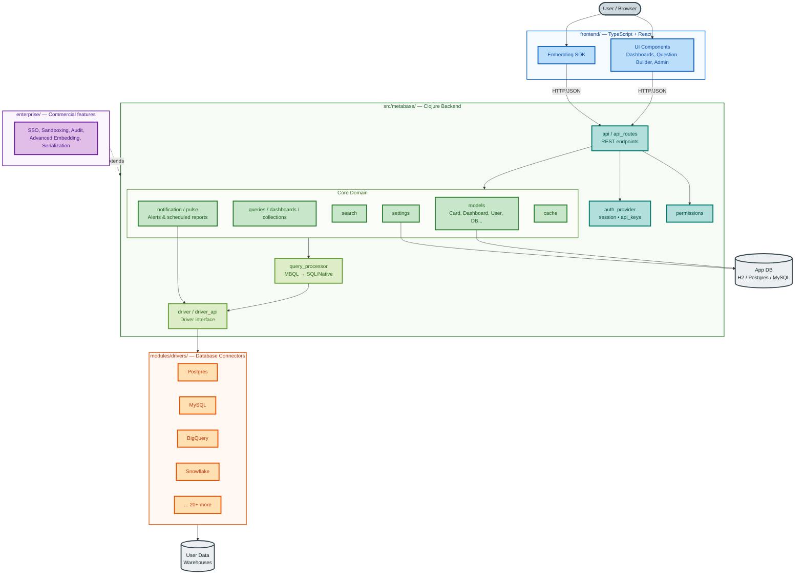

# Metabase

[Metabase](https://www.metabase.com) is the easy, open-source way for everyone in your company to ask questions and learn from data.

## Architecture

## Get started

The easiest way to get started with Metabase is to sign up for a free trial of [Metabase Cloud](https://store.metabase.com/checkout).

You get expert support, backups, upgrades, an SMTP server, SSL certificate, SoC2 Type 2 security auditing, and more (plus your money goes toward improving a major open-source project). Check out our quick overview of [cloud vs self-hosting](https://www.metabase.com/docs/latest/cloud/cloud-vs-self-hosting). If you need to, you can always switch to [self-hosting](https://www.metabase.com/docs/latest/installation-and-operation/installing-metabase) Metabase at any time (or vice versa).

## Key Features

- [Set up in five minutes](https://www.metabase.com/docs/latest/configuring-metabase/setting-up-metabase) (we're not kidding), or have us [host Metabase for you](https://www.metabase.com/cloud/) so you don't even need to think about it.
- Let anyone on your team [ask questions](https://www.metabase.com/docs/latest/questions/introduction) without knowing SQL.
- Use the [SQL editor](https://www.metabase.com/docs/latest/questions/native-editor/writing-sql) for more complex queries.
- Ask AI: [Metabot](https://www.metabase.com/docs/latest/ai/metabot) gives you answers you can trust, helps you write queries, and more. Or build your own [AI agent](https://www.metabase.com/docs/latest/ai/agent-api) to query your data.
- Build handsome, interactive [dashboards](https://www.metabase.com/docs/latest/dashboards/introduction) with filters, auto-refresh, fullscreen, custom click behavior, and more.
- Use [documents](https://www.metabase.com/docs/latest/documents/introduction) for long-form data analysis, and invite people to comment.
- [Transform](https://www.metabase.com/docs/latest/data-studio/transforms/transforms-overview) raw data into analytics-ready tables, track down broken dependencies, and define canonical metrics in Metabase's [Data Studio](https://www.metabase.com/docs/latest/data-studio/overview).
- Set up [alerts on your data](https://www.metabase.com/docs/latest/questions/alerts), or schedule [dashboard subscriptions](https://www.metabase.com/docs/latest/dashboards/subscriptions) to email, Slack, or even a webhook.
- Curate content in a [Library](https://www.metabase.com/docs/latest/data-studio/library), and [version your work with Git](https://www.metabase.com/docs/latest/installation-and-operation/remote-sync).
- [Embed Metabase in your app](https://www.metabase.com/docs/latest/embedding/introduction), with components for charts, dashboards, data browser, AI chat, and more. You can even put [an entire Metabase](https://www.metabase.com/docs/latest/embedding/interactive-embedding) in your app.
- Set granular [permissions](https://www.metabase.com/docs/latest/permissions/introduction) that work for both internal teams and embedded analytics, whether you co-locate your customer data, or give each customer their own database.
- Dark mode, content translations, and way more stuff than we can list here.

Take a [tour of Metabase](https://www.metabase.com/learn/metabase-basics/overview/tour-of-metabase).

## Supported databases

- [Officially supported databases](./docs/databases/connecting.md#connecting-to-supported-databases)
- [Community drivers](./docs/developers-guide/community-drivers.md)

## Installation

Metabase can be run just about anywhere. Check out our [Installation Guides](https://www.metabase.com/docs/latest/installation-and-operation/installing-metabase).

## Documentation

The [Metabase handbook](https://www.metabase.com/docs/latest/).

## Contributing

To contribute to Metabase, see our [Developer docs](./docs/developers-guide/start.md).

## Extending Metabase

Hit our API to integrate analytics. Check out our guide, [Working with the Metabase API](https://www.metabase.com/learn/metabase-basics/administration/administration-and-operation/metabase-api).

## Internationalization

We want Metabase to be available in as many languages as possible. See which translations are available and help contribute to internationalization using our project over at [Crowdin](https://crowdin.com/project/metabase-i18n). You can also check out our [policies on translations](https://www.metabase.com/docs/latest/administration-guide/localization.html).

## Security Disclosure

See [SECURITY.md](./SECURITY.md) for details.

## License

This repository contains the source code for both the Open Source edition of Metabase, released under the AGPL, as well as the [commercial editions of Metabase](https://www.metabase.com/pricing/), which are released under the Metabase Commercial Software License.

See [LICENSE.txt](./LICENSE.txt) for details.

Unless otherwise noted, all files © 2026 Metabase, Inc.

## Community

- [Discourse](https://discourse.metabase.com/)
- [Twitter](https://x.com/metabase)
- [LinkedIn](https://www.linkedin.com/company/metabase/)
- [YouTube](https://www.youtube.com/@metabasedata)
- [Reddit](https://www.reddit.com/r/Metabase/)

## Metabase Experts

If you'd like more technical resources to set up your data stack with Metabase, connect with a [Metabase Expert](https://www.metabase.com/partners/?utm_source=readme&utm_medium=metabase-expetrs&utm_campaign=readme).
